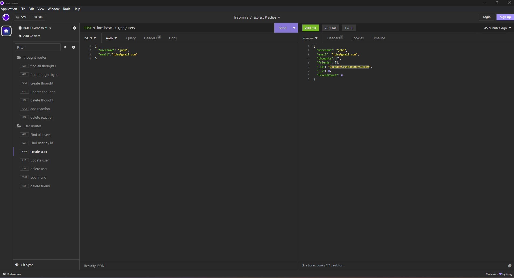

# Social-Network-API

## Description
this app provides a space where users can make friends, make posts, interact, and add reactions, this app uses javascripts, and mongo.db

## Credit

Daniel Lee for helping collaborate with this challenge and being extra eyes to find bugs within the code

## License
This repository is licensed by MIT. See https://mit-license.org/ to learn more.

## Usage
Watch this walkthrough video: https://drive.google.com/file/d/1TWKxwahFwqdITNWMdH1LcrKZdchXeVL1/view

